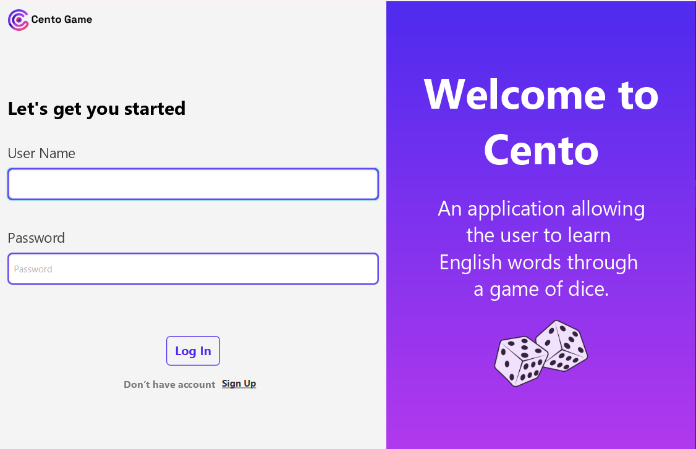
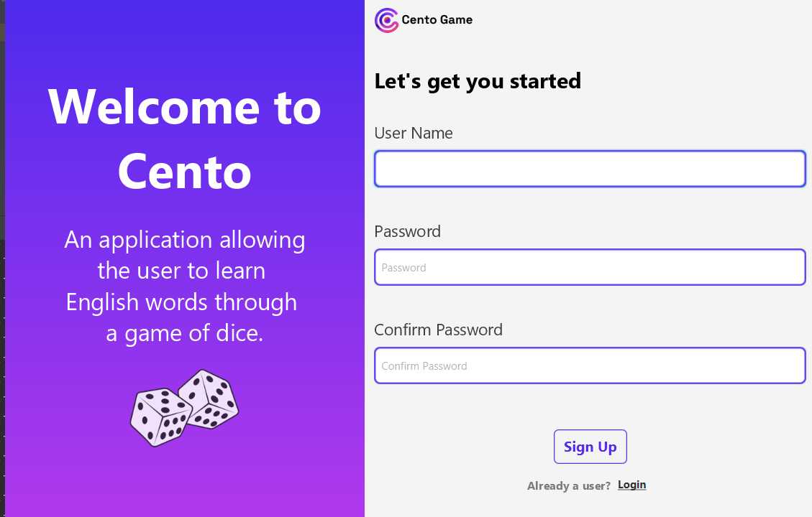
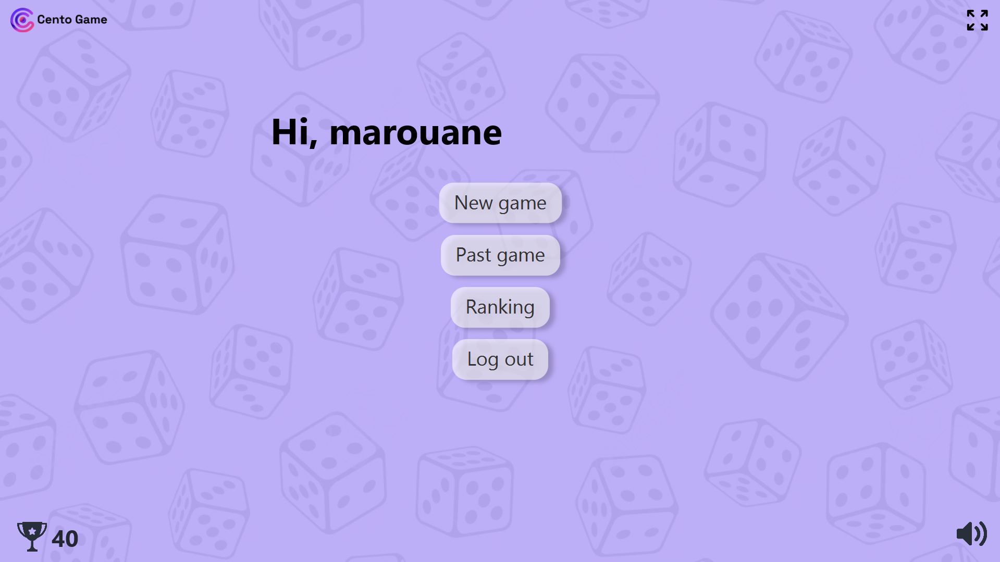
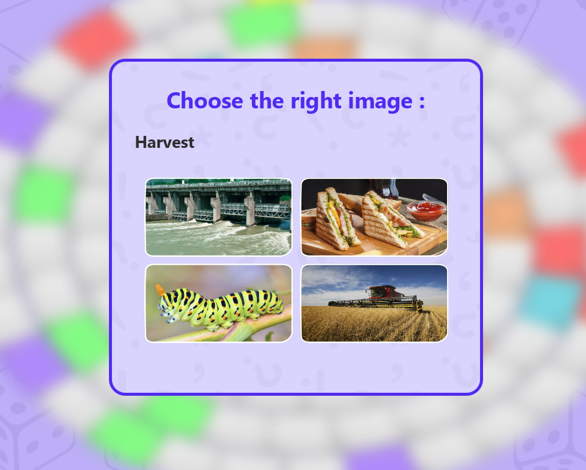
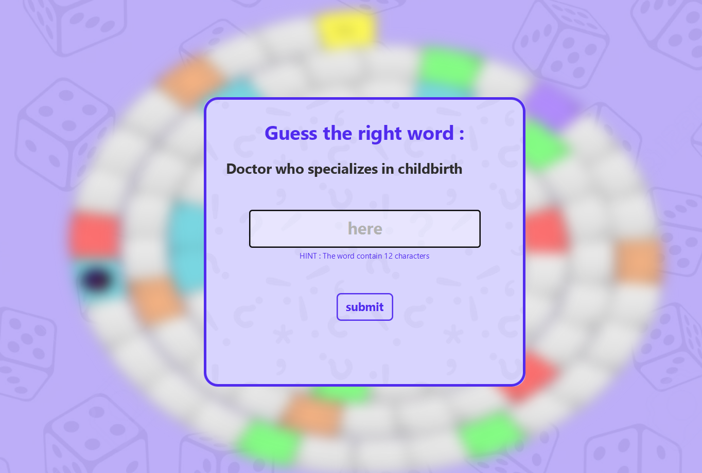
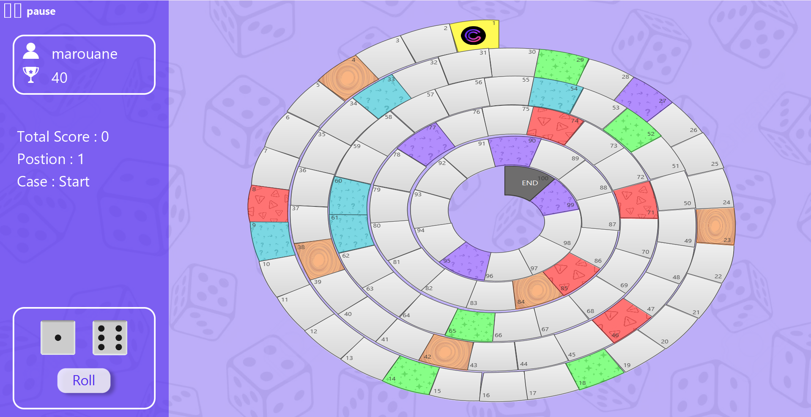
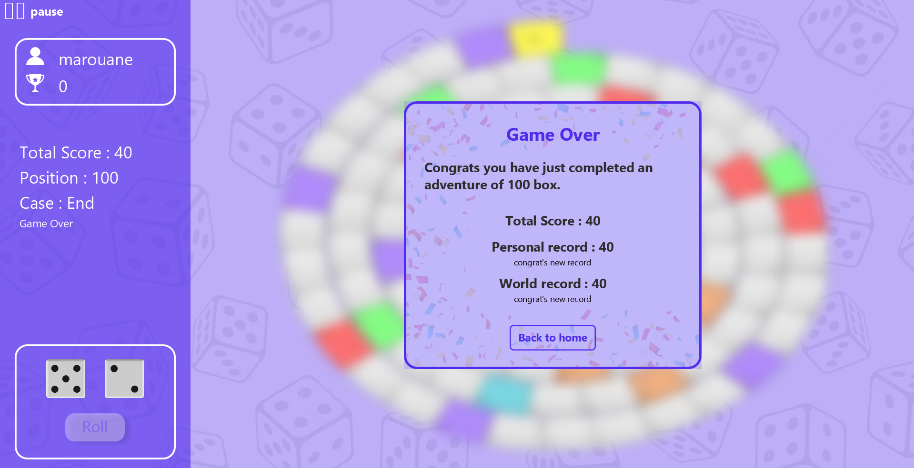
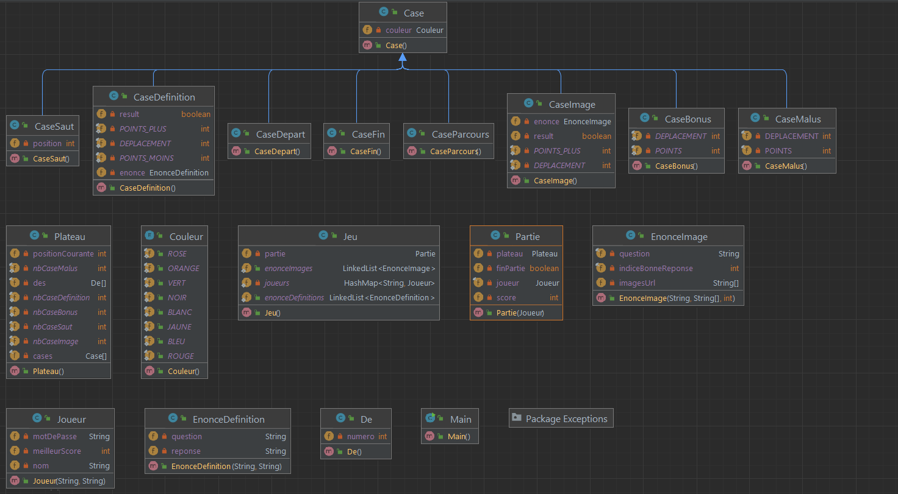

# CENTO Game

Welcome to CENTO, the exciting desktop application that combines the thrill of dice rolling with the challenge of learning English words! Enhance your vocabulary in a fun and interactive way through a game of dice.

## Table of Contents

1. [Introduction](#introduction)
2. [Features](#features)
    - [Login and SignUp](#login-and-signup)
    - [Home](#home)
    - [Interactive Game of Dice](#interactive-game-of-dice)
    - [End of Game Pop-up](#end-of-game-pop-up)
    - [Class Diagram](#class-diagram)

## Introduction

CENTO is a desktop application designed to make learning English words an engaging and entertaining experience. The game combines the elements of a traditional board game with the excitement of dice rolling. Roll the dice, move through the board, and enhance your vocabulary while having fun!

## Features

### Login and SignUp

Before you embark on your CENTO journey, create an account by signing up or log in if you already have one. Your progress will be saved, allowing you to continue your language learning adventure from where you left off.

#### Login

#### SIGNUP

### Home

The home screen provides a central hub for all your CENTO activities. Here, you can:

-   Create a new game and start your word-learning adventure.
-   Continue past games and pick up right where you left off.
-   Check the leaderboard to see how your vocabulary skills compare to others.

### Interactive Game of Dice

Get ready for an immersive game of dice where each move is a chance to learn and progress. The game board is filled with different colored cases, each with its unique impact:

-   **Green Case:** Move forward by 2 spaces, and gain 2 points towards your final score.
-   **Red Case:** Move backward by 2 spaces, and lose 2 points from your final score.
-   **Yellow Case:** Teleport to a random position on the plateau for an added challenge.
-   **Purple Case:** Answer a question about an English word using images to reinforce your understanding.
    

-   **Blue Case:** Answer a question with a one-word response, accompanied by a hint about the number of characters.
    

-   **Overview :**
    

### End of Game Pop-up

Upon reaching the end of the game, a pop-up will appear to congratulate you on completing the CENTO challenge. View your final score, see how many words you've mastered, and revel in your language learning achievements.

### Class Diagram

Below is a simplified class diagram illustrating the key classes and their relationships in CENTO, where Object-Oriented Programming (OOP) concepts are utilized to structure the game. The user interface (UI) is implemented using **JavaFX**.

